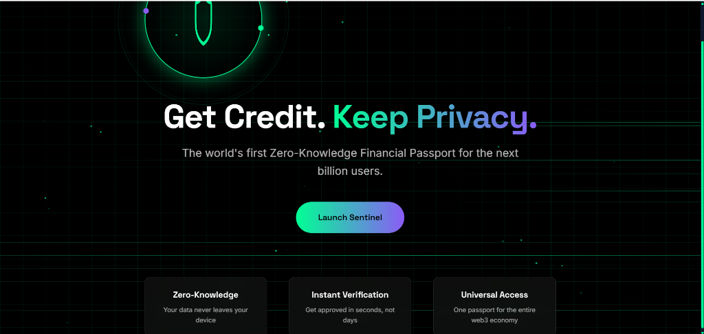
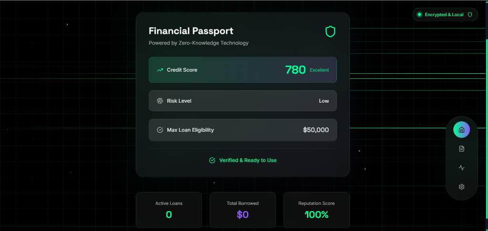
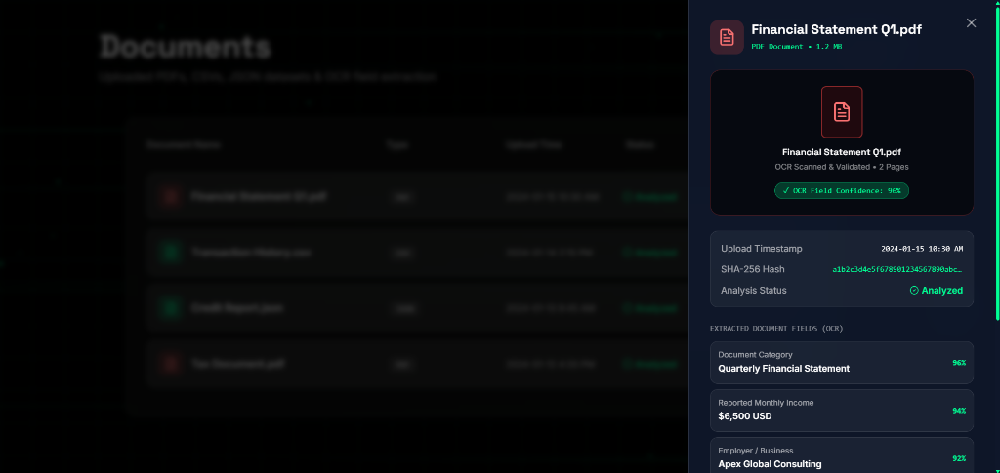
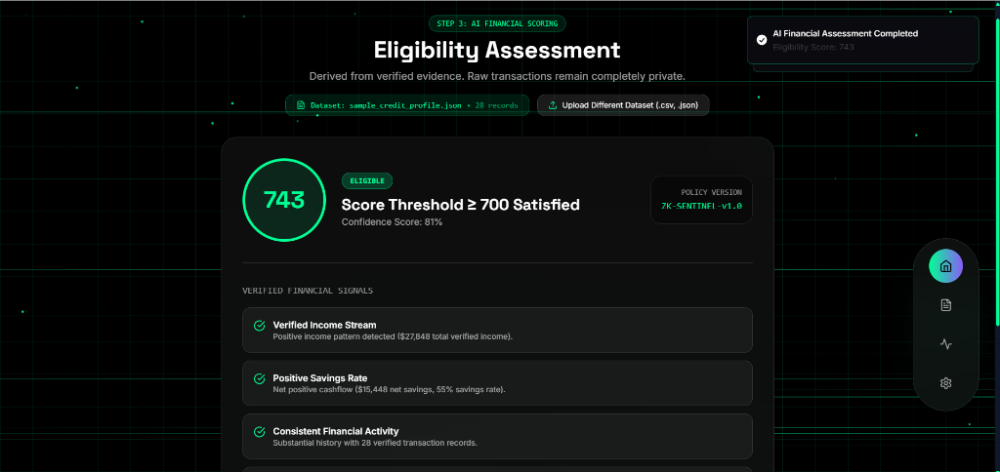
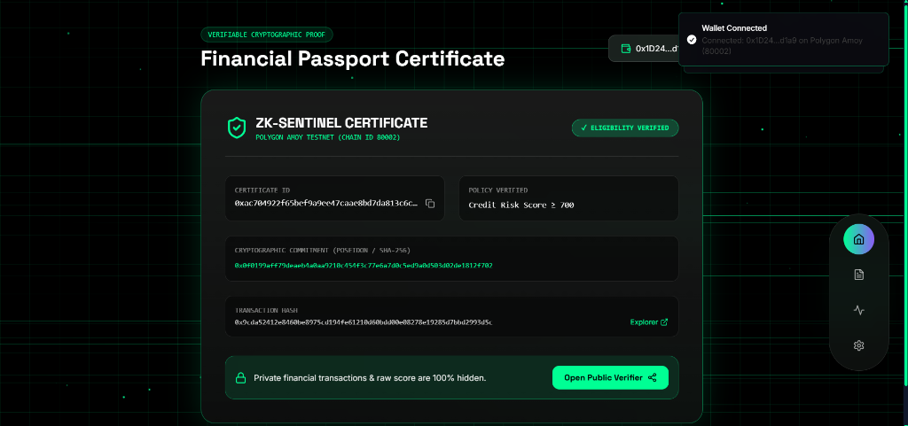
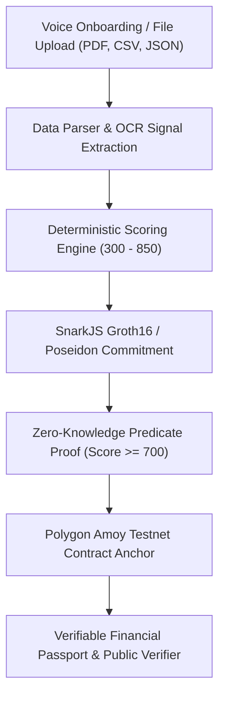

# 🛡️ ZK-Sentinel

### Verifiable Financial Identity for the Next Billion Users - Powered by Agentic AI & Zero-Knowledge Proofs

[](https://zk-sentinel-project.vercel.app/)
[](https://zk-sentinel-project.onrender.com)
[-8247E5?style=for-the-badge&logo=polygon&logoColor=white)](https://amoy.polygonscan.com/address/0x4A8F2b77C401a6136B3693F7A02C264b38d386E8)

---

## 🌐 Live Deployment Links

- 🚀 **Frontend Web Application**: [https://zk-sentinel-project.vercel.app/](https://zk-sentinel-project.vercel.app/)
- ⚡ **Backend Core Express API**: [https://zk-sentinel-project.onrender.com](https://zk-sentinel-project.onrender.com)
- 📜 **Smart Contract (Polygon Amoy Testnet)**: [`0x4A8F2b77C401a6136B3693F7A02C264b38d386E8`](https://amoy.polygonscan.com/address/0x4A8F2b77C401a6136B3693F7A02C264b38d386E8)

---

## 🚨 Problem Statement

1. **Credit Exclusion for the Unbanked**: Over 1.4 billion adults globally have no traditional credit score (FICO/TransUnion) because they operate in informal economies, freelance platforms, or emerging markets.
2. **Severe Privacy Breaches**: Traditional credit assessment requires applicants to hand over unencrypted PDF bank statements, tax returns, and PII to third-party lenders, leading to identity theft and surveillance.
3. **Over-Collateralized Web3 Lending**: Decentralized finance (DeFi) platforms currently require 150%+ collateral for loans because they lack a privacy-preserving mechanism to verify creditworthiness without exposing user data on a public ledger.

---

## 💡 The Solution — ZK-Sentinel

**ZK-Sentinel** is a Zero-Knowledge Financial Passport that transforms messy bank statements, CSV transaction records, and voice onboarding inputs into cryptographically verifiable credit certificates.

- **Zero Raw Data Persistence**: Raw financial transactions and PII stay local or are processed ephemerally. They are **NEVER** stored on public blockchains or database servers.
- **Cryptographic Zero-Knowledge Predicate Proofs**: Proves $\text{Credit Score} \ge \text{Threshold}$ (e.g. $\ge 700$) without exposing the underlying credit score ($743$) or financial balances ($27,848$).
- **On-Chain Verifiable Certificates**: Anchors Poseidon/SHA-256 cryptographic commitments to Polygon Amoy Testnet for instant, tamper-proof verification.

---

## 📸 Application Walkthrough & System Screenshots

### 1. Landing Page & Hero Section
> **Get Credit. Keep Privacy.** The gateway to decentralized finance and instant credit verification.



---

### 2. Verifiable Financial Passport Card
> User credit health overview displaying credit rating, risk tier, maximum loan eligibility, and reputation score.



---

### 3. Document Hub & OCR Signal Extraction
> Upload financial datasets (PDF, CSV, JSON) with instant OCR field extraction, quality ratings, and SHA-256 integrity hashes.



---

### 4. AI Financial Assessment & Explainability
> Multi-agent scoring breakdown detailing verified income streams, savings margins, transaction velocity, and privacy guarantees.



---

### 5. Zero-Knowledge Proof Certificate & On-Chain Anchor
> Cryptographic ZK certificate displaying Poseidon commitment, transaction hash, Polygonscan link, and public verification trigger.



---

## 🔄 Complete Feature Flow & System Architecture



---

## 🧠 Key Concepts & Explanation ("What Means What")

### 1. What the Credit Score Means
The **ZK-Sentinel Credit Score** is a dynamic financial health score ranging from **300 to 850**, calculated from four key signals:
- **Income Depth**: Verified regular income streams and monthly earnings.
- **Savings Rate / Cashflow Margin**: Ratio of net savings relative to total expenditures.
- **Transaction Velocity**: Frequency and consistency of financial transactions over time.
- **Data Quality Rating**: Completeness and structural validity of uploaded records.

### 2. Why a Web3 Wallet is Used & What it Does
- **Decentralized Cryptographic Identity**: Your EVM wallet (MetaMask, WalletConnect) acts as your private digital identity.
- **Ownership of Proofs**: You control the private key required to generate certificate commitments. No central authority can revoke or tamper with your verified financial standing.
- **On-Chain Anchoring**: Your wallet signs the transaction to anchor the cryptographic proof hash onto the Polygon Amoy blockchain.

### 3. What Zero-Knowledge (ZK) Predicate Proof Means
A **Zero-Knowledge Proof** allows a user to prove a statement is true without revealing any extra information:
- **Lender Statement**: *"Is your credit score $\ge 700$?"*
- **Traditional Proof**: Handing over bank statements showing $743$ credit score and $27,848 balance.
- **ZK-Sentinel Proof**: Generating a cryptographic proof ($\text{Score} \ge 700 = \text{TRUE}$) using Poseidon commitments. The lender verifies the proof on-chain without ever seeing $743$ or $27,848.

### 4. What Cryptographic Commitment Means
A **Commitment** ($h = \text{Poseidon}(\text{score}, \text{salt})$) is a cryptographic hash locked on-chain. It prevents a user from altering their score after verification while keeping the raw numbers completely hidden.

---

## 🛠️ Technology Stack

- **Frontend**: React 18, Vite, TypeScript, TailwindCSS, Framer Motion, Lucide Icons, Sonner.
- **Backend API**: Node.js, Express, TypeScript, Multer, CSV-Parse, Ethers.js.
- **Zero-Knowledge Circuit & Proving**: SnarkJS, Circom, Poseidon Hashes, SHA-256.
- **Smart Contracts & Blockchain**: Solidity (`ZKCertificateRegistry.sol`), Hardhat, Polygon Amoy Testnet (Chain ID 80002).
- **Deployment**: Vercel (Frontend), Render (Backend API).

---

## ⚙️ How to Run Locally

### Prerequisites
- Node.js `v18.0.0` or higher
- npm `v9.0.0` or higher

### Step 1: Clone the Repository
```bash
git clone https://github.com/archisha-codes/ZK-SENTINEL-project.git
cd ZK-SENTINEL-project
```

### Step 2: Install Dependencies
```bash
npm install
```

### Step 3: Configure Environment Variables
Create a `.env` file in the root directory:
```env
PORT=4000
NODE_ENV=development
POLYGON_AMOY_RPC_URL=https://rpc-amoy.polygon.technology
POLYGON_PRIVATE_KEY=your_private_key_here
ZK_VERIFIER_CONTRACT_ADDRESS=0x4A8F2b77C401a6136B3693F7A02C264b38d386E8
```

### Step 4: Run Development Frontend
```bash
npm run dev
```
Open [http://localhost:5174](http://localhost:5174) in your browser.

### Step 5: Run Express Backend Server
In a separate terminal window:
```bash
npm run server
```
Backend API will be live at [http://localhost:4000](http://localhost:4000).

---

## 📁 Repository Structure

```
ZK-SENTINEL-project/
├── circuits/                  # Circom ZK circuits & verification keys
├── contracts/                 # Solidity smart contracts (ZKCertificateRegistry.sol)
├── demo-datasets/             # CSV & JSON financial test datasets
├── docs/images/               # README screenshots & media assets
├── scripts/                   # Smart contract deployment scripts
├── server/                    # Express backend & ZK scoring engine
│   ├── services/              # Scoring, Data Parser, Blockchain services
│   └── index.ts               # API server entrypoint
├── src/                       # Vite React frontend application
│   ├── components/            # AssessmentView, CertificateView, VoiceOnboarding, etc.
│   └── App.tsx                # Client routing & state management
├── hardhat.config.js          # Hardhat Polygon Amoy configuration
└── tsconfig.json              # TypeScript configuration
```

---

## 📄 License

Distributed under the MIT License. See `LICENSE` for more information.
